# Roadmap

Target release of compiled templates `v0.9.0`

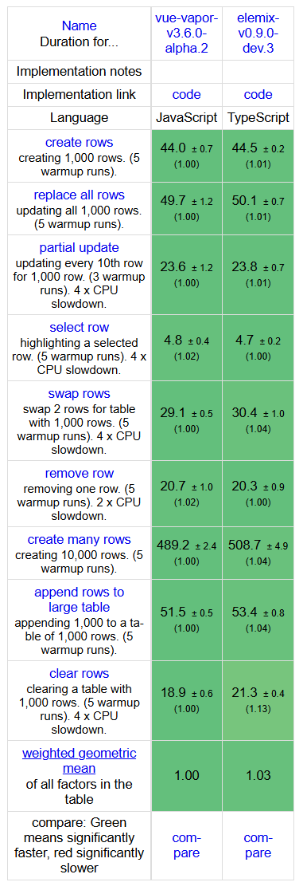

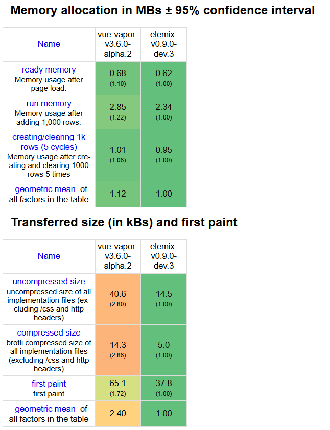

***Hunt never ends... 🌃🦇🌃***

- Row swap gap was driving me insane 😡😡😡 The difference was disproportionate to the amount of work ⌛


- Managed to squeeze a bit more out of it 🍋‍🟩🍋‍🟩🤏
- I think I can let go now... I am broken 🥲🧠🔨🤣

GG 👊🥋✊


### Post v0.9.0 Release

- [] Focus on proper editor support
  - [] Full-blown LSP server in `analyzer`
  - [] Focus on VS Code as the target
  - [] Extension for template highlighting of `tpl`
  - [] Linting extension based on the `analyzer` LSP mode
  - [] Possibly combine into a single one for easier release
  - [] Look into automatic publishing to the `vscode` marketplace, and make it part of the release pipeline
- [] Add currated `clanker` skill, include it in monoropro, add it to `elemix.dev`

### Phase 7 - Close the release of v0.9.0 ❎

***This Is The Way 🚀👽***

- So initially I thought I'd support vanilla JS and TypeScript. Changed my mind - don't care, and I won't be compromising my
  values trying to solve other people's problems, that is how you end up with `React` 🤣🤣 Who am I to tell people that by
  using `js` in 2026 they are doing it wrong 🤷🤷 Foot is down 🥾 `typescript` is the de facto standard right now 💡✨
- I will keep a good distance from coupling the compiler too much to TypeScript 🔥🔥

***Gotta Match 'Em All 🥅🦕***

- Added `match(value, cases)` - exhaustive, type-checked pattern matching, the strict sibling of `choose` directive 🎯 Two forms: a
  literal-union or enum value matched directly, and a discriminated object union matched on a key, where each arm is handed
  the member narrowed to that case 🧬
- The analyzer has its back 🤝

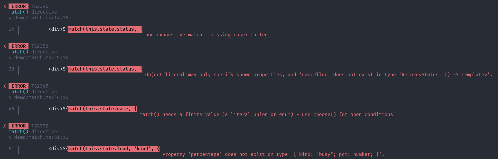

***Loot Drop 🪅🔨***

- Compiler resilience: output for primitives in local state has changed - the backing fields for getters and setters are now prefixed
  with `#__count` etc 🛡️
- Added a [starter template](https://github.com/neuralfog/elemix-template) repo at https://github.com/neuralfog/elemix-template 🧩🚀
- Added [Compiler Explorer](https://compiler-explorer.elemix.dev/) and linked on landing page https://compiler-explorer.elemix.dev/ ⚙️
- Added `createApp()` - an optional app bootstrap with chainable `.config()` / `.mount()`; app config lives on
  `window.__elemix__` 🪟🚀
- Added built-in cloaking - elemix auto-adopts a `[data-cloak], :not(:defined)` sheet so elements don't flash before they
  upgrade and mount, swap the rule with `config({ cloak })` ✨
- Added `config({ shadow: false })` to render light DOM by default, plus a new `#shadow` hint to force a shadow
  root - `#shadow` and `#no-shadow` together errors in both the compiler and the analyzer 🌗🚫
- Divorced `@storybook/web-components-vite` from storybook - moved the storybook to `@storybook/html-vite` and ripped web
  components out of the dependency tree entirely (it always rendered plain string/Node, so what's the point ⁉️) 🔥

- Fixed a bug where the compiler would only lower arrow function definition for template definition, now it will work
  with both function definition and method 🐛🐞
- Fixed issue where helper templates only inlined in the arrow field form, so a `${this.row(x)}` helper in a `template() {}`
  method (or tucked inside a nested template) got left as a runtime call and blew up 💥 Sorted - helpers inline wherever
  you call them now 🪄🐛
- Fixed multi-root conditional branches now render every root (only the first was kept before) 🪄🐛
- Fixed custom events (`@my-event`) now fire (`_event` falls back to `addEventListener`) 🪄🐛

- [] Additional polish of playground examples, organize examples better or not 🤔
- [] Conformance (potential bug fixing)
  - [x] Convert wikipulse app
  - [] Convert stealth app (over 200 components)
- [] Put a website at `elemix.dev`
  - [x] Landing page
  - [x] Documentation driven by markdow files
  - [x] Selectable verion same as Laravel docs
  - [] Write the actual docs 😒
- [] Update all `README` files at the moment are just autocomplete filler from the `minion` 🤖
- [] Full release of `v0.9.0` and let's make it official 🎉🎉🎉
- [] Add elemix to official benchmarks

### Phase 6 - Analyzer 📊

***Out Of This World Output 🌌🎨***

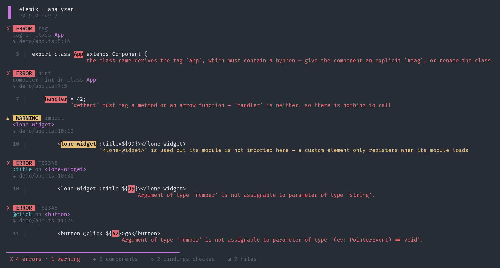

***Hints With A Conscience 🧿#⃣️***

- The analyzer now validates every `// #...`

What it nails 🔨

- Unknown directive - `// #componnt` → unknown pragma directive 🕵️
- Bad #tag - conflicting #tag values, or #tag on the wrong thing 🏷️
- Invalid custom-element name - every way it can be wrong: no hyphen, uppercase, reserved SVG/MathML name (font-face),
  bad start char (1-card), illegal char (my-c@rd) - each with its specific reason 🚫 A tag that throws at customElements.define
  is broken 💥💥💥
- Module #state - a store must be an object, not a bare primitive 📦
- Lifecycle / effect targets - #effect/#mount/#before-mount/#dispose may tag a method or arrow field only, never a plain value ⚡
- #state targets - the inverse: #state tags reactive data, never a function or a method 🪞

***The Ghost Elements 👻📦***

- Custom elements only register when their module loads - `#component` fires defineComponent as an import side effect.
  So `<user-card>` with no import to its module renders... nothing 🤬
- It's a warning, not an error - project could still load the module elsewhere 🟡
- When working with a bundler it's good practice to import modules wherever a component is used in a template, imports will
  be tree shaken 🌳

***Bindings On A Leash 🦮⚡***

- `@event` / `:ref` / `~model` / `~onmodel` get type-checked against the runtime actual contract 🔗

The contracts 📜

- `@event` → the handler, typed per the specific DOM event 🎯 `@click` wants a PointerEvent, `@keydown` a `KeyboardEvent`,
  @input an Event. Keyed off `HTMLElementEventMap`, so `@click=${(e: KeyboardEvent) => …}` gets flagged 💥
  A generic `(e: Event) => void` still works everywhere.
- `:ref` → `{ value }` shape ✅
- `~model` → `{ value: string }` (two-way bind needs a string box) 🪣
- `~onmodel` → `(value: string) => string` transform ⚙️
- Custom event names (@my-thing) fall back to Event instead of erroring 🛟

***Props That Can't Lie 🎯🔍***

- The analyzer now type-checks every :prop=${expr} against the component's actual prop type - cross-component, resolved by tag 🏷️
  A template hole is an opaque string to `tsc`, so it never sees these. Now it does.
- Type judgment is the one thing oxc can't do, so it's delegated to the project's own `tsc` 🔮

What it catches 🎣

- Value mismatch - :name=${42} when name: string 💥
- Unknown / typo'd prop - :naem=${x} → <user-card> has no prop 'naem' 🕵️
- Missing required prop - even a bare <card></card> with no props gets every required one flagged ✅ Optionals omitted stay clean.
- Enums, unions, generics, branded types - all check for free, because it's real tsc judging real types 🆓
- Checked in scope, so a prop fed from `this.state`, a getter, a local, or a list-row param is validated exactly the same 🔬

***Static Analysis For Templates 🔍📈📉***

- Analyzer shipping as separate package 📦
- CLI:
    - `--dirs` - sources to scan, directories (recursive) or globs, mix as many as you like 📂
    - `--dirs` src → whole dir, recursive
    - `--dirs` 'src/**/*.ts' → explicit glob (quote it so the shell doesn't eat it)
    - `--dirs` src tests 'lib/**/*.ts' → dirs + globs together

  `--root` - project root with node_modules + tsconfig.json, where the project's own tsc resolves 🌳 (defaults to .)

  `--lsp` - spit out LSP-shaped JSON instead of the pretty caret report, for editors/CI 🔌

  And the bits worth a line each:
  - ea short alias, elemix-analyzer long - same binary 🥷
  - needs node + the project's typescript; pure-Rust checks (hints/tags/imports) run without it ⚙️
  - NO_COLOR kills colour, COLORTERM=truecolor lights up 24-bit; auto-plain when piped 🎨

- `--lsp` mode has been implemented with proper formatting (JSON), this should work as a one-shot tool.
  `nvim` has `vim.diagnostic` and can integrate on `BufWritePost`. `vscode` has `onDidSaveTextDocument`
  and can `child_process.execFile`. This is first iteration which is dumb, scan all files on every run.
  Adding a full-blown `lsp` server should not be that difficult in the future. For now editor should be
  able to show diagnostics post save 📝
- Transient files for typechecking did not work 💥💥 The trick: build a virtual overlay of the file (in tsc)
  and wrap each hole in place - `${__ck<UserCard,'name'>(expr)}` 🪄

### Phase 5 - General Polish And Wrinkle Ironing ⛓️‍💥

***Chores 🥣🧽***

- Prove async 🔂
- One changelog for all packages, less bureaucracy 🗂️
- Fixed compiler hint detection in the Vite plugin 🚪
- GitHub releases now ship all binaries as downloadable assets 📦⬇️
- WASM package ships its own readme now 🕸️📄

***My Subclass Has Daddy Issues 👨‍👦***

- Component inheritance now works correctly 🧬
- Turned out most stuff just already worked 😅🍀
- Lifecycle hooks + effects were shadowing the base - now they chain through `super` ⛓️
- Styles were replacing instead of merging - derived now adopts base sheets plus its own 🎨

***Make It So 🖖***

- Component state now can have primitives assigned, following through on a single concept of state 🧱✨

```ts
// #state
count = 0; // ← stays reactive
```

- Compiler lowers the primitives to a set of tracked getters and setters ⚙️🪄
- For now module-level states (stores) can only have objects assigned, this is enforced by a compiler error 🛑
- This may change in the future if I can find a clean solution without a prescan of all files 🤔 At the same
  time it makes sense for stores to have state as an object, so maybe this is not an issue at all... 🤷📦
- Fixed an issue with a dangling `Cargo.lock` after a release 🐛

***I'm Givin' Her All She's Got, Captain! 🚀⚙️🔥***

- List reconciler one map instead of two ✌️ (fewer allocations)
- Found a faster path for row swaps 🔀 it's just two nodes moving, so move two nodes and skip
  the whole diff - ~1.1ms gone 💨 Puff...
- Added a fuzz test - 800 rounds of random shuffles, swaps and inserts on lists 🎲
- Can't find any lever for clearing rows 😭🤣

***Do Androids Dream of a Logo? 🤖🐑***


- The rectangle is the `component` 📦 The lightning bolt is the speed ⚡

***Lifecycle Methods In To Macros 🔁#⃣️***

- Lifecycle methods have been stripped from the main `Component` class 🔥🔥
- There was a bit of inconsistency there, split between methods and macros, so lifecycle methods into macros #⃣️#⃣️#⃣️

```
┌───────────────┬────────────────┬────────────────────────────┐
│               │      tags      │            does            │
├───────────────┼────────────────┼────────────────────────────┤
│ #before-mount │ method / arrow │ beforeMount hook           │
├───────────────┼────────────────┼────────────────────────────┤
│ #mount        │ method / arrow │ onMount hook               │
├───────────────┼────────────────┼────────────────────────────┤
│ #dispose      │ method / arrow │ onDispose hook             │
└───────────────┴────────────────┴────────────────────────────┘
```

- Multiple hints of lifecycle methods are allowed, the compiler will inline them in the source order they were declared ⬇️⬇️
- So having multiple `// #mount` and so on is fine 😶‍🌫️😶‍🌫️

```ts
// #mount
foo(): void {
  // ...
}

// #mount
bar(): void {
  // ...
}

// Inlined as --> Component Instance

onMount(): void {
    this.foo();
    this.bar();
}
```

- Syntax for macros may change, not a biggie, purely cosmetic 🧐
- Tried to come up with better management of `effects` and have them excluded from the `onMount` procedure, decided to have
  effects fire any time an update is triggered including `onMount`, strictly speaking this is more correct and expected.
  There is a convoluted escape hatch with `read` ➡️ `check mounted state` ➡️ `execute` 🤮 This is incredibly difficult
  without disturbing the settled ecosystem. Effects are eager - it has to stay that way, foot is down 👟
- So in an ideal world effects read reactive state, write to the outside world. The moment an effect writes back into reactive
  state it reads, you're in recursion loop territory 💣💣 Don't do it...
- Now an effect can't re-trigger itself off its own write, so that whole class of infinite loop is just gone 🛡️

***Final Hunt 🦇🦇🦇***

- Added two ended diff in the list reconciler which I found by going through the `vue-vapor` repo ♥️
- Fixed a reconciler bug 😬 The list effect was subscribing to all 1000 row ids on every reconcile
  (moved the key reads inside untrack). Correctness + dead weight gone 🚀
- Closing the last gap means going shallow ref and losing deep reactivity, not worth it 🪑
- Nested proxy allocates more - every object in the tree gets wrapped + tracked, a shallow ref
  is just one box 📦 From my testing, going shallow ref I can drop row creation on 10k rows going
  down to about ~490 - 495ms. Not worth it... ☹️

***Compiler Errors ⚙️➡️🕸***

- Compiler now inlines errors and warnings so they propagate to runtime 🏃‍➡️⌚️
- This is initial work, this opens possibilities that are not possible in normal workflow such as detecting
  unimported components, which is an absolute pain with custom elements, nothing renders, why ?? 🤨⁉️
- Diagnostics and errors are always printed to `stderr` 🔳
- Added `--strict` to prevent the compiler from emitting and inlining any `errors` and `console.warn` in production fe ⛵️
- Need to think hard about this, there is an analyzer coming shortly which should be responsible for diagnostics 🤔
  Rework if needed when shipping the analyzer 🎯 Hard failures need to be handled either way, wasm build has to be
  supported so depending on bundlers is not an option here 🙅

***Application without state and side effects is useless ☁️☁️☁️***

- Collections have been added to reactive state so `Set`, `Map`, `WeakSet` and `WeakMap` are fully supported now ✅
- Usage of `classes` in reactive state has been proven and fully covered with tests 🚦
- Private fields will throw from the level of proxy, same behaviour as `vue` 😒
- Added helper `raw` to skip reactivity setup for granular control, helps battle the case above, `vue` inspired ♥️
- Added regression gate protecting deep reactive state, fixed the bug where nested arrays were not supported 🐛 
- Hot path is being protected at all costs ♨️♨️♨️

***Drag Racing 🚜💨💥***

- This is as far as I can push it without changing, adding or rearchitecting the core of the lib 🚫
- The issue is `deepReactivity` that I don't want to compromise on, there is more allocation with
  the current set up, but gives me the freedom and ability to keep single concept for state management
- Optimised allocations, memory usage and hot path ♨️♨️♨️
- Other option is to add special primitive with a shallow ref to satisfy benchmark and shoot further
  ahead - pointless as this will not represent the real use case and dilute the api adding confusion
  by exposing different ways of managing state 😵‍💫😵‍💫 Won't compromise the api for the sake of the bench 🪑
- I get `deepReactivity` out of the box, no `.value` all over the place, no special `setThis` or `setThat`
  nonsense just to kick off the update 🤮
- I can throw almost anything at the state and it will just work ✅
- Compiling reactivity experiment 🔬 - can be done with shallow refs but not worth the effort, too many
  restrictions and massive complexity added to the compiler. One of which is typescript dependency
  and forcing explicitly typed state all over the place, limitations of what I can throw at the state.
  Generated code had too many corner cases and weird limitations I would have to explain 🫨🫨🫨
- I think there may be another way, basically coming up with highly specialized data structure for the
  compiler to spit out, similar to what `ivi` does, not todays me problem 🔮 Atm proxy at runtime
  is as optimal as it gets for this particular use case 🎯🎯🎯
- Btw what the hell React is doing, official benchmarks showing that React 19 with a compiler is
  slower than a normal React app 😂😂😂 What is the point, what are they doing ⁉️⁉️🤷🤷

***Don't underestimate the power of the dark side 🌑☀️*** 

- Added ability to disable `ShadowDOM` with `// #no-shadow` pragma ☀️
- Styles set on instance `// #styles` become noop, not adopted
- ShadowDOM is enabled by default, opt in to disable
- Also decided to keep `// #component` as mandatory, the idea was to strip it, but it will be better
  to have it in current form as it allows extending `components` further 😬

```
#no-shadow on → #styles is skipped, no sheet code emitted (just the dangling css string)
#no-shadow off → #styles lights back up - sheet(css) + __sheets + adopted into the shadow root
```

All Compiler Hints:

```
┌────────────┬────────────────┬────────────────────────────┐
│            │      tags      │            does            │
├────────────┼────────────────┼────────────────────────────┤
│ #component │ class          │ register                   │
├────────────┼────────────────┼────────────────────────────┤
│ #tag       │ class          │ override derived tag       │
├────────────┼────────────────┼────────────────────────────┤
│ #form      │ class          │ form-associated            │
├────────────┼────────────────┼────────────────────────────┤
│ #no-shadow │ class          │ light DOM (styles noop)    │
├────────────┼────────────────┼────────────────────────────┤
│ #styles    │ field          │ adopt stylesheet           │
├────────────┼────────────────┼────────────────────────────┤
│ #state     │ field / const  │ wrap in state<T>(…)        │
├────────────┼────────────────┼────────────────────────────┤
│ #effect    │ method / arrow │ owned reactive effect      │
└────────────┴────────────────┴────────────────────────────┘
```

***Compiler Hints Rewrite & Effects #⃣️🌀***

- This slowly starts to become what I envisioned 😶‍🌫️🥳
- Redesigned compiler hints, string literals were a bad idea, they can't be used on class members #⃣️#⃣️#⃣️
- All hints are position dependent, they decorate property on next line 📍
- Marker marks, the real declaration holds the value - so `tsc` still checks it ✅
- Going full blast on code generation here 💥💥💥
- Fully redesigned with comments syntax `// #....`
- `// #component #tag hello-there` behaviour unchanged 🧊
- `// #state` is used to decorate naked objects and class members 🛟
- `state` and `effect` are macros now - injected from `/runtime`, ripped out of the public barrel 🔪
- `// #styles` moved to class member, can't have values in comments in a straightforward manner 🫟
- Exposed `isMounted` on component adding ability to check programmatically if component is mounted or not
- Added `// #effect` which registers procedure to run side effect, similar to watchers in `vue`, this
  style is way cleaner (solid style), don't have to be specific about property to watch, just use it 🚤
- Multiple `// #state` and `// #effect` are allowed in scope of component 💪💪
- `mergeClasses` helper dropped ♻️
- Simple Effect:

```ts
// #effect
mirror() {
  this.setAttribute('data-count', String(this.state.count));
}

// #effect
mirror = (): void => {
  this.setAttribute('data-count', String(this.state.count));
}
```

- Both arrow fields and methods work for effects 🪢
- Effect can skip the mount run (this may change if I can think of cleaner way):

```ts
// #effect
save() {
  const c = this.state.count;     // ← read first → tracked
  if (!this.isMounted) return;    // ← skip the mount
  localStorage.setItem('count', String(c));
}
```
***Source Maps 🗺️🗺️🗺️***

- Turns out I don't need the fancy version 🤓 compile is splice-based, so real code - methods,
  getters, `defineComponent`, imports - survives VERBATIM, just shifted down by the lines
  the compiler bolts on (runtime import, hoisted `template()` consts, the expanded `view()`) 🪄

***Design Analyzer Diagnostic Tool 🚦🚦🚦***

- This is way harder than I initially thought, my first instinct I will have to mess with `tsc` was
  correct ✅
- Is not as bad as it could be though, can't be native - there is no independent typescript checker
  out there that I can use, writing my own is pure insanity and asking for trouble 💥
- Good news that most of the hard work is already done in compiler so I can get all metadata that
  is needed 🌋
- One thing that became obvious - typechecking has to be performed by the same version of `tsc` that
  the project is using, so using something other than `tsc` would be wrong here, I am looking
  for consistency here 📐
- New crate for `ec-analyzer` and compiler as dependency 📦
- I can perform typechecking on transient/synthetic file with type assertions with `tsc`, take the
  results - augment - and present 📺
- I will be aiming for two modes `--pretty`: human readable for cli, and `--lsp`: lsp compatible
  json format, hopefully that will give me a lever for code editor integrations 🔌
- Not sure if that will work or not, there will be no real `lsp` server running, try and 👀👀👀
- If `--lsp` mode will not work drop it, small amount of effort is just formatting 💥
- For conformance of `--lsp` mode I will be forced to build plugin for editor 😒 FML
- `nvim` and `vscode` 📝
- Locked in design doc `ANALYZER.md` 🔒

***Resilience ⚙️⚙️⚙️***

- Statements before return in template procedure had been stripped, this has been fixed with
  prelude in rewrite stage 🥇
- So far haven't seen any issues related to hoisting post compilation 🤔
- Multiple components per file are allowed now
- Parameterized helper templates 🎉 `${this.row(item)}` now inlines - splice substitutes the
  helper's param for the call's arg (identifier-aware, skips strings + property names) and splices
  it in 🔬 The win: extract list rows into a named method, `repeat(items, (i) => this.row(i), key)` 📜
  ⚠️ note: a helper that shadows its own param inside its body would over-rename - rare and not worth
  full scope analysis 🤏
- Template-less pragma components (`#component #styles`, no `tpl`) were silently skipped by the
  vite tpl-only filter and never registered. Fixed 💥 a regression from adding compiler hints 🤦
  The gate now lets pragma blocks through too 🚪
- Compiler CLI now greets you with a banner 🪧 version baked in at build from `package.json`
  Go-`ldflags` style (`$npm_package_version`), omitted in `--stdin` pipe mode 🤫 no more shite
  hand-rolled JSON parsing in `build.rs` either, killed it with fire 🔥

***Computed Properties 🧮🧮🧮***

- No need for it, native getters do the job just fine `get test() {}`
- I have manual way to drive updates `this.render()` if necessary
- The mechanic: the view's effect subscribes to whatever it reads through tracked getters. So:

```ts
get total() { return this.state.qty * this.state.price; }   // ✅ reads state → reactive
get total() { return this.qty * this.price; }               // ❌ plain fields → computes once, NEVER updates
```
- In the ❌ case the getter still runs and returns the right number on first paint, but nothing tracked it, so
  changing `this.qty` later won't re-run the view. This is by design 🎨
- At least one value in getter has to come from a reactive source ☢️
- Chains fine too: a getter reading another getter just works ⛓️

***Release Pipeline Fixed 🪚🪚🪚***

- Entire pipeline reworked to fail early ❌
- `npm` packages will be only published if all artifacts available 📦
- Hopefully no more partially released packages 🙏
- `RELEASE-PIPELINE.md` 🗺️

***Compiler Hints #⃣️#⃣️#⃣️***

- For time being the simplest possible solution to serve sole purpose of replacement for class decorator
- `#component` auto registers the component inlining `defineComponent` procedure, if no tag name will 
  be derived from class name. This was a headache in runtime as I had to preserve class names otherwise
  mangling would screw references, not an issue any more. If a class is named incorrectly `defineComponent` will
  throw from custom element registry level 💥 May need to handle it gracefully, later when extending `compalerino`
  capabilities.
- `#tag my-component` defines tag name for custom element #⃣️
- `#styles ${css}` allows setting styles on component previously handled by static class field 💅
- `#form` registers component as form member ✍️
- The nice thing about going with string literals is that I can have dynamic values, also this is valid syntax
  in js world 🪐
- All fixtures are using new syntax now #⃣️

### Phase 4 - Put it through its paces - BENCH Round 2 🔔🔔🔔

***Optimisation Phase ⚙️🔨🪛***

- Bundle size `2.74kB` - most likely final form 😰
- Optimised a lot, emitted code and some obvious things in runtime, but this gets to the point that is very hard
  to move a needle and everything just becomes a trade off... I will park it here 🙂‍↕️🙂‍↕️

***Update Personal Perf Repo 🏁🏁🏁***

- All dependencies updated and there were no issues whatsoever with anything, shite 💩 just works 🤓
- Compilation with vite plugin just works, no hiccups whatsoever ⚙️
- HMR just works with `compalerino` 🙌😎
- Single `state` instead of `signal` was a good choice, there is also no shitty 💩 `foo.value` all over the place, this
  feels clean now ✨
- Cleaned up export barrels, so much better 🏋
- App feels way snappier than before, feels good!! 👌
- Chrome performance, first paint dropped by a mile 🚗
- Memory profile also looks better at a glance 🕵 Will do more digging later 🧠🧠🧠
- Ticks are a tad slower on 10k compared to the old renderer, but hey who the hell renders 10k components with ticking state
  (`animationFrame`) on every component coming from 3 different sources 😂 Yeah try having that in React - good luck 🍀

## Compiler - I don't React. I compile. 😂😂😂

### Phase 3 - Why would you use a fork for eating soup 🍴 Packaging and Tooling 🛠️

***Compiler As Vite Plugin 🥷🥷🥷***

- Closes the tooling chain 🔗 write `tpl` templates, vite compiles them on the fly as it loads each module - compile step invisible 🥷
- Drives the NATIVE binary 🚤🚤🚤
- Native CLI got a new `--stdin` mode 🚰 pipe source in 🪠🪠🪠
- Ships as `@neuralfog/elemix-vite` 📦 native compiler a dependency, `vite` a peer
- One tag rules them all 💍 a single `v*` tag fires BOTH the compiler + vite releases; vite waits for the compiler to land on npm
  first so an installer never sees a missing dependency ⏳
- The compiler dependency is auto-stamped to the release version during the workflow run 🤖 the plugin always pins the exact
  compiler build it ships with
- Release pipeline mapped in `RELEASE-PIPELINE.md` 🗺️
- Proven end to end via the throwaway repo `https://github.com/neuralfog/test-compiler` 🗑️ `pnpm prove:vite` builds a real component
  through the published package
- No source maps yet 🗺️❌ compiled output maps to `view()`, not the original `tpl`
- HMR not explicitly tested 🤔 transform re-runs per load so it should work, just unverified

***Compiler as WASM ⚙️⚙️⚙️***

- The whole `compalerino` served as a WASM module 🕸️🦀 playground can transpile on every keystroke 🤯
- Went single crate, feature gated - no crate split shenanigans, simplicity wins 🧈
- `compile()` is pure `oxc`, zero IO, so it crosses the wasm boundary squeaky clean - only the filesystem/CLI
  bits (`clap`, `glob`, file scanning) get gated out behind a feature 🚪
- `wasm-pack` + `wasm-opt` spit out a tidy `--target web` package, squashed down to `~697kb` from a chunky 32MB debug blob 🪓🔥
- Ships as its own npm module `@neuralfog/elemix-compiler-wasm` 📦
- WASM output is BYTE for BYTE identical to native across all 37 fixtures 🧬 if it ever drifts the snapshots will scream 😲🔫
- Panic free on half typed garbage - `oxc` just shrugs and passes the source through, the module never dies 🛡️
  exactly what I need when the playground hammers it per keystroke ⌨️
- Final boss 🐉 a storybook story compiles a component INSIDE a real browser, compiled output rendered live on screen - wasm proven
  in its natural habitat 🦇
- Hooked into the test pipeline + CI, and publishes on the same `tag`
- Testing pipeline mapped in `COMPILER-TESTING-PIPELINE.md` 🗺️
- Channel delivery proven end to end via the throwaway repo `https://github.com/neuralfog/test-compiler` 🗑️
- Rust finally gets linted 🦀💈 The audacity 🙈

***Compiler Packaging 📦📦📦***

- Compiler now ships as an npm module `https://www.npmjs.com/package/@neuralfog/elemix-compiler` 📦
- Tightening the release process as I go, moving to `tag`-based releases 🏃🏾‍♂️🏃
- Compiler ships as an executable across the entire matrix of operating systems and CPU architectures 🤓
- Directives and the template definition `tpl` tag have been turned into compiler-only macros ✨
  JS will throw if any bleed into post-compiled sources 🥷🥷🥷
- Removed any traces of reflection from the codebase 🔥🔥🔥 What's the point in this case ⁉️
- Dropped `changeset` package 🤢 in favour of a few scripts
- Further defining the testing pipeline, now typechecking happens on fixtures which are user-defined
  components that still need to pass `Typescript` typechecking for correctness. Additionally I locked
  the output of `emitted` files with snapshots for further resilience. If anything changes, I need
  to know about it 😲🔫
- Fully tested `dev` version of compiler delivered via the `npm` channel on different OSes and CPUs via
  a temporary repo: `https://github.com/neuralfog/test-compiler` 🚅🚅
- Fixed an issue with imports for `tpl` during the rewrite stage in compalerino 🎯
- Bundle size back to `2.67kb`
- Minion has been invaluable, it earns its keep 💰

### Phase 2 - Compiler Implementation 🦀🦀🦀

This went better than I expected:
- Almost all tests in elemix have been removed now, decided to keep only tests related to package orchestration
  and render cost, old tests got me here, but they were only transient. So smash that delete button big time.
  Deleting code is my favourite activity.
- Full integration testing happens in the compiler package, rust unit tests, compiler output. Compiled components
  passed through `typescript` and exhaustively tested for interaction with storybook.
- The idea of snapshotting was kinda cute, well, it did not work. I caught 3 different bugs related to emitted code by running
  components in a real browser environment 💪💪💪
- Treat it as a first unoptimised pass - I will see what the benchmarks say, not getting my hopes up 🙈
- Entire runtime has been dropped 🌟
- Open for possibilities of custom `pragma like` hints that will be trivial to implement ❤️
- Best example I can think of replacing freaking decorators with custom compiler hints (in the end I get what I want
  just better and no coupling to typescript 🤮❤️)
- OXC does all the heavy lifting for me - tooling is absolutely amazing to work with, in opposition to trying to hook into
  the `typescript` compiler workflow with some shitty plugins that break on every release - what a joke!! 💩💩💩 Saying that
  I most likely will have to poke at that shite again... 💀🔫 FML
- Removed testing package 🥹 That stuff did some real heavy lifting 💪
- Repository is in an approved state to be merged to the main branch 🚀🚀🚀
- All work done in the past is not lost (interpreted renderer). If not for that, I would not be able to move to a compiled workflow,
  not to mention benefits like establishing an almost-final api and battle testing the concept 🥹🪦
- Most of the work that the compiler does is derived from the old `renderer` ❤️ The only reason why this happened so quickly ⚡
- Prototype => Proof => Compiler 🚀🚀
- All marker nodes have been dropped, on a 10k list this will have a big impact - 2 holes per row 20k redundant DOM nodes 💥💥💥
- Further tightening of public facing API
- Unified concept of state single `state()` for internal and global state definition
- Divorced from `html` notation for templates - that's Lit; this is not Lit, so `tpl` 🚀
- Bundle size down to `2.56kb` - not bad at all 😎😎😎
- Will the prerelease need a convention like `alpha` or `experimental`?

### Phase 1 - Get ready before fun starts

What went well:
- All the tests and apps - playground, perf and stealth app containing more than 100 components
  created a nice contract that is hard to break
- Runtime layer was a good idea - exposing a minimal integration layer that generated code
  can call into, this will simplify code generation as the contract is already established
- Rewritten reactivity model heavily inspired by Solid that just works. Channeling Ryan Carniato.
  There is no need to reinvent the wheel.
- I had a completely different idea of how to handle generated code, it was supposed to be a bolt on
  for existing instances... Well rewrite in place - basically trying to do zero cost abstraction here.
  Lower down to native code as much as possible.
- Ripping off the bandaid and literally starting from scratch. Best decision ever. Performed open
  heart surgery 😂 "This is an operating table and I am the surgeon here..." 🦇 I am batman 😂
  Note to self insanity levels increasing 😂😂😂
- All the render code has been eliminated - no more baggage
- All reactivity code has been replaced with simplified model based on concept of the `effect`
- By deleting all the code final bundle size dropped to `2.67kb` without any feature loss 🌟
- Reduced number of classes to 1, can't get away from that... I need super daddy to extend from.
- Readability and maintainability of the codebase are incomparable, code is crystal clear 💎
- Reactivity primitive and `effect` system already tested and validated by reproducing playground
  apps and a few more to get a wider surface for compiler implementation.
- Hand rolling compiled components surfacing the final output created a contract that the compiler has to
  conform to.
- Directives will become noop macros just for the compiler, and will not be shipped in the final bundle.
- No more messing with template literals, `tpl` becomes a template for the compiler only, no more
  template literals at runtime ❤️
- LLM has been invaluable here with proper instrumentation I have generated implementation surface
  very quickly, would take me ages to type it all in ☠️ That includes `golden` components and
  stories running in real browser within storybook to assert behaviour
- Managed to repurpose LIS algo and list reconciliation

## Resolve Identity Crisis - What the hell is this ⁉️🐦‍🔥

- `customElements` rocks!! 🎸🤘
- Class based API depending on the point of view it's a strength or weakness, it does not bother me so `class`
  it is, no module transpilation, what's the point ⁉️
- This is not a framework, it's a library at best. Frameworks get in the way 🚷
- Opt-in reactivity, drive your own updates if you like 🏇
- `AOT` compiled templates with minimal runtime
- Be in charge of architecture 🌉
- Single dependency or bundle at runtime without any sub dependencies (no vulnerabilities nightmares) 👹
- `Constructable Stylesheet` API 💅
- Freedom - good library, framework or api does not get in the way - wishful thinking in the current state of
  the affairs and tooling 🤮
- Full encapsulation with `ShadowDOM`
- Will work in any environment, it is just augmented `HTML` node - Vue, React whatever 🤷
- `css` is just a string that gets adopted, use whatever you want 🤷
- `Reactive Elements` - CustomElements are amazing, Google claimed `WebComponents` don't want to touch that 😒
- Few primitives and you can do more than others. `state`, `ref` and `component` FINITO!! 🤌
  Anything else just write it, or `gitgood`
- Part of the native DOM flow `customElements` are just DOM nodes 🤏
- Native web is amazing, not the freaking abominations 🧟 that industry is pushing on me 🚫🚫
- Simpler API the better LLM can work with it 🤖

## Know the Limitations 🏁🏁

- High chances of clashing with native `HTMLElement` properties, not a biggy. Typescript catches it cleanly 🥅
- Template primitives only work in the context of library, there is no issue with attributes
  May add special `attr` that will redirect into props of the `:host`, actually this should be EZ 🤌
- At the moment still closely coupled with typescript, slowly going away from that so `js` should be supported
  sooner than later
- SSR - I don't give a flying `&*%*%*&` - is not a problem at all. `customElements` are notoriously difficult
  to fully server render 😒 Yeah, return `HTML` from server == `SSR` 😂 May poke at this in the future seems
  like interesting problem to have 🧐
- Tooling targeted at CLIs, don't have time to deal with editors - last thing I need in my life is to work with
  junk like (VSCode plugin eco system🤮)
- SPA don't care - what's the point ⁉️ If you really want to push it just use something from `npm` black hole 😂⚫

## DONE

- [x] (Not relevant anymore - gone with new architecture) Why the hell do I need direct props 🤔 What's the difference between `.value=${}` and `value=${}` - none
  - [x] Kill this thing with fire 🔥🔥🔥
  - [x] Unnecessary dance with virtual attr and holes `value=${}` assignment just works in a reactive manner 🤔
- [x] Rust 🤮 + OXC the javascript toolchain - battle tested, there is no better alternative
  - [x] Unless I go my own way and write it from scratch in Zig, Odin or OCaml 😂
  - [x] Not sure if it's worth the pain though when I have a toolchain that I can use off the shelf
  - [x] Dependency chain is not an issue as I can freeze version by compiled executable
- [x] Api has to stay unchanged - this is a must!!
  - [x] Manual render `this.render()`
  - [x] State, signals, and props
  - [x] Apart from small changes like removing virtual attributes and moving statics!
- [x] Main goals
   - [x] Can I increase speed, although I am close to the limitations of native DOM operations 🎉
   - [x] Literal milliseconds do not matter on row swaps etc. This is faster than it has to be!!
   - [x] Freedom and api is what matters
- [x] Memory usage, this is a clear win
- [x] Initial bundle size should drop, I would want to be in the range of 3 - 4kb ideally not 6.7kb 😬
- [x] Generated code will add some weight, but this will be application code, reused by component instances...
- [x] Downside, a build step, although this is not an issue at all as it already goes through typescript
- [x] Compiler first architecture opens some crazy opportunities later down the line ❤️
- [x] Code is kinda shite right now... 💩 This is clearly going in the direction of an effect (FP, OCaml, Solid) λ λ λ λ λ λ
  - [x] Using generated code spat out from the compiler should make code a lot more readable and maintainable
  - [x] Most likely all runtime code responsible for template evaluation will be gone or most of it
  - [x] Same will apply to state, right now it is a hybrid between coarse rendering and granular observables with
    versioning and dirty flags - big mountain of crap in the middle of a clean room 🤮😂 It works though...
- [x] Evaluate the compiler, otherwise kill it with fire 🔥🔥🔥 Entire thing!! - Yeah it will work...
- [x] Need to define `tpl` type for user to define templates
- [x] The whitespace rule has not been exercised yet...
- [x] All the tests are broken at the moment while migrating, they will be invaluable as a final boss to make sure there is no regression.
- [x] Semantics polish: state and signal are both functions now, conceptually there is no difference between the two.
  Stick with one or the other most likely `state()`, signals are a Solid thing...
- [x] Package compiler with multi-arch support via npm
- [x] Most likely need another two packages derived from compiler
- [x] Exe shipped as npm module
  - [x] Same as tsc, accepts params and configs etc
  - [x] Delivery of different CPU architectures should not be an issue
  - [x] Where do I spit the files, do I augment the original files and spit them out to the `.cache`
    directory ?? 🤔
  - [x] 2-pass compilation process, `elemix compiler` => tsc => js 
- [x] Turn `tpl` and directives into noop macros!
- [x] `tpl` needs to be exportable from the `elemix` package for proper typechecking
- [x] Typecheck fixtures as part of test
- [x] `tpl` import needs to be stripped once post-processed
- [x] Lock the emitted output of components with fixtures
- [x] I am using `Reflect` purely as a stylistic choice, may add a few nanoseconds as it is an additional function call.
  Most likely not an issue... - Killed with fire 🔥🔥🔥
- [x] Automate version management for the compiler
- [x] Tag management
- [x] Approve compiler packaging for `main` landing 🚀
- [x] `ec-wasm` needs to be able to transpile on `playground`
- [x] Rust compiles to wasm - first class support - can still use it in playground
- [x] Most likely `ec-vite` plugin, got to find a way to make compilation as painless and invisible as possible
    vite plugin is a good candidate here, I can hook into the `vite` compilation process, I did it before
- [x] Compiler `cli` may change based on two requirements above - Yes it did 😂
- [x] In theory this should be the easiest part, hard work is done!! 🚀🚀🚀 EZ just ton shite of work 💩💩💩
- [x] Streamline release with tags ✅
- [x] Finish single tag release for all packages, automated publishing via github actions
- [x] Add changelogs, refer to `https://github.com/brownhounds/migoro` for a full implementation with releases and workflows
- [x] Release v0.9.0-dev.0
- [x] Update `perf` personal repo with new toolchain and compiled version of framework ⚡️⚡️
- [x] Got to check behaviour of vite plugin on more complicated projects - many files etc - Just works!!
- [x] Render Cost Table looks suspicious - 4 nodes have been touched on moves, I'm pretty sure it should be just 2 🤔
  There was a bug!! 🐛🐛🐛
- [x] `onMutation` - Hmmm... Added for one specific reason, detect DOM mutations in an async context, do I still need this ??
    Renderer is fully sync now, what it should be, no `ticking`, no waiting 🤔 - has been removed, not needed anymore!
- [x] At the moment the reactivity primitive is running off `defineProperty`, maybe better to swap to proxy. - Not an issue at all!! 🚝🚝🚝
- [x] Run official benchmarks and 👀👀

***Round 1***
- [x] ✅ Competitive with React, Vue and Angular
  - [x] Faster than React and Angular, very close to Vue benchmarks
  - [x] Weighted Geometric Mean:
    - vue                   1.23
    - elemix                1.32
    - angular               1.37
    - react 19 with hooks   1.42
  - [x] Beats all of them on byte transfer:
    - elemix    6.7kb
    - vue       22.8kb
    - react     51.4kb
    - angular   44.2kb
  - [x] Beats all of them on first paint:
    - elemix    60.6
    - vue       97.7
    - react     228.5
    - angular   180.8
  - [x] I was winning in the memory department by a mile, but
    - proxy removal
    - automatic memo for list rendering and identity keys
    caused a massive memory spike, a lot of tracking and object retention 😬

  - [x] Framework/Lib Api has been frozen - I don't want any more changes I am in a good spot
  - [x] I am bringing bigger guns this time
    - [x] Now I am going after the rest of the party!!
    - [x] Benchmark is purely focused on hyper optimisation for list rendering, so yeah, tuff!! 😂😂😂

- [x] Near native performance going through thin layer of reactivity - well most likely not 🤔 Close enough 🎉
- [x] Memory will drop drastically ✅
- [x] Time to first paint should drop as there is less setup code before component mounts (no more template
  evaluation and tracking) ✅
- [x] Why is this static ?? `public static styles?: string[];` styles get adopted in `connectedCallback`
  - [x] Leftover from decorator
  - [x] Make it non static
  - [x] Allow adopting styles during runtime (connected state)
    - [x] Use getters and setters

- [x] Compiler hints (macros #⃣️) 🧐
  - [x] Syntax have to pass typescript typechecking phase - most likely `#component` <= This is just a valid string 🤔
  - [x] No special syntax - don't care about editors so it has to just work 🔩
  - [x] Do I make macros position line independent, maybe (global and line specific ones) ⁉️🧐
  - [x] Architecture for this has to be clean AF - ability to easily extend
    - [x] For now 2 types of macros `global` and `positioned`
  - [x] This will resolve two issues at once
    - [x] Decorators are Typescript dependent and stink 🦨
    - [x] Automatic component registration with tags derived from component classes, no more issue with name `mangling`
      after bundling
- [x] Release pipeline is junky ♻️ Mostly works... The order is not correct
  - [x] Organize workflows into a nicer dependency chain
- [x] Do I need concept of `computed(() => {})` ⁉️🧐 Don't really want it... Dig into it 🪏 Proof the
  concept, otherwise add `computed` 🤮 The issue here - architecture has changed, the concept of computation
  was not needed before 🧐
- [x] Object destructuring in template procedure, this should already work 🤔
- [x] Multiple components per file
- [x] Inline parameterized helpers `${this.row(item)}` 🤏 arg-substituted + identifier-aware now,
  not just zero-arg - the win is `repeat` driven list rows 📜
- [x] Design `compiler hints`
- [x] Add banner to rust cli - omit for --stdin
- [x] Poke at sourcemaps at some point ⏰️⏰️

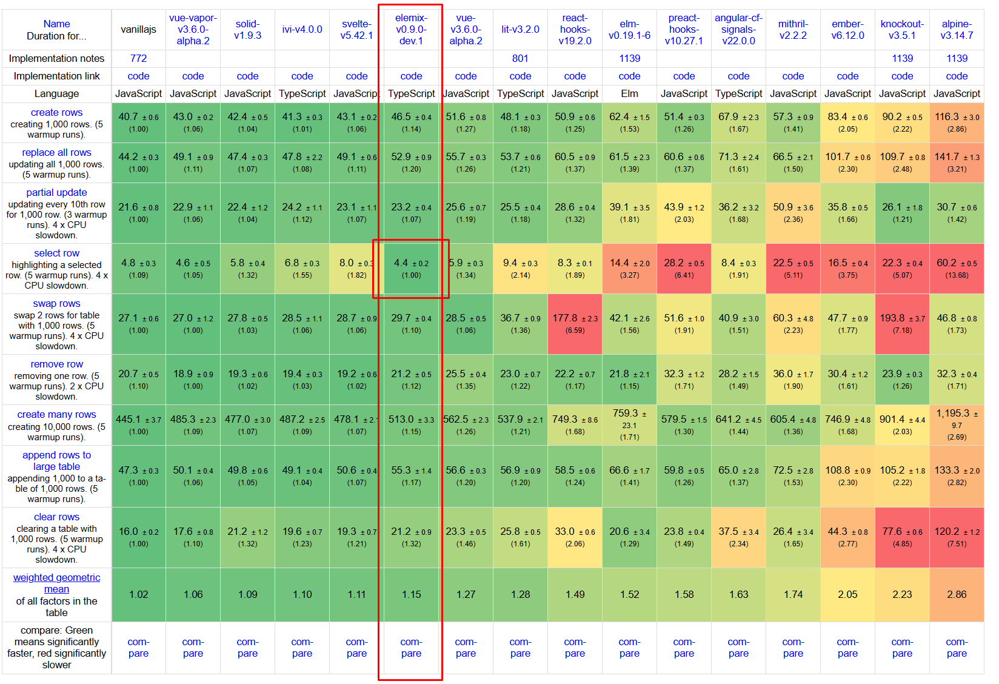

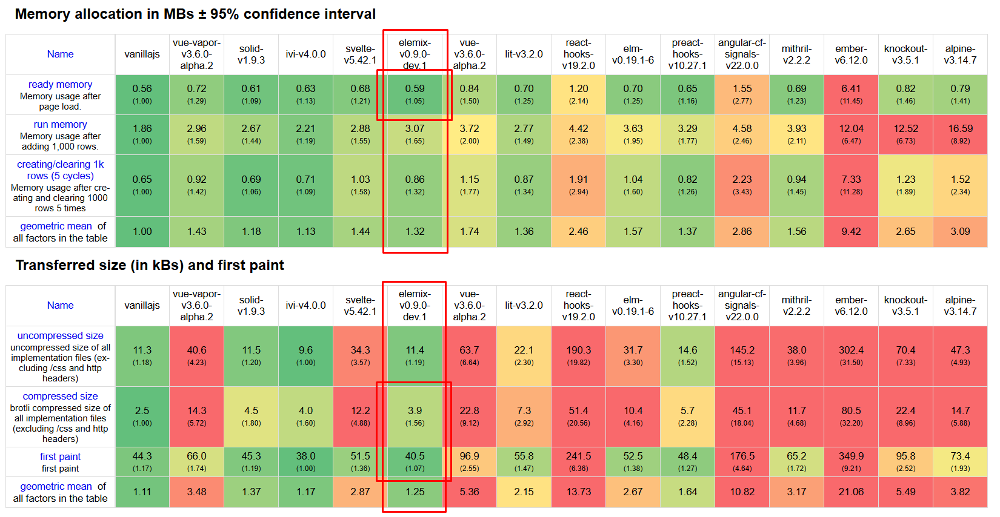

***Round 2*** 🏆🏆🏆

- Sitting very high on TOP - next to GREATEST `solid`, `ivi` and `svelte` 🙇🙇🙇
- Honestly this was way too easy 😂😂😂 
- Most commercial frameworks just got smoked big time 💨💨💨 React 🔫 - `gitgood` 🤓
- Pulled nice distance from `vue 3` and `lit` ♥️🥹
- No cheating, driving test fully via reactive state - no manual DOM operations 🙅🙅🙅
- Very happy with overall matrix, no yeller or red on any fields 💚💚💚
- Not the fastest, but incredibly consistent across the board 🏅
- `select row` - the fastest, faster than vanilla js ✅ Most likely invariants from the test run, makes no sense TBH 😂
- `smallest bundle` - across the board ✅ - this may change, but in a good spot not to overinflate ☑️
- `second` - on first paint ahead of vanilla js ✅
- `lowest memory` after initial page load ✅
- I have to be careful I may spend rest of my life optimising trying to pull ahead 😂😂😂 Too addictive 🚬
- Usage memory has been dropped below 3mb after further optimisations 🎯

- **Only tested selected matrix, the full picture will be visible on full release after `PR` to official repo**

***Officially not a slop, satisfied with results so further work will continue***

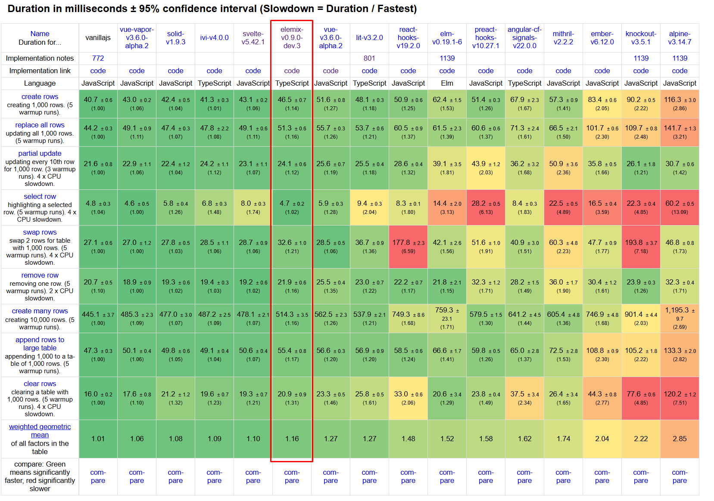

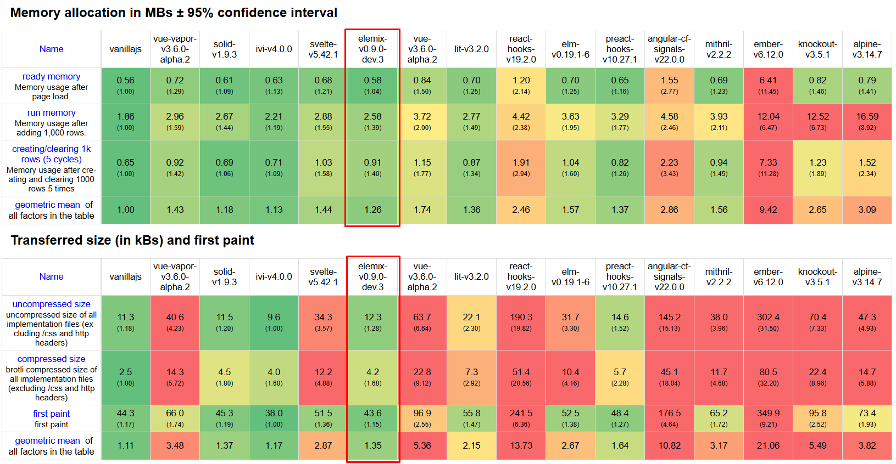

***Round 3*** 🏆🏆🏆

- Reduced memory usage which is huge down to `2.58mb` 🎉🎉🎉
- Final bottleneck to close the gap - creating rows is too slow 😒
- I think I can close the gap there 🧐🧐🧐
- Can I compile away reactivity layer ⁉️ I don't know 🤷

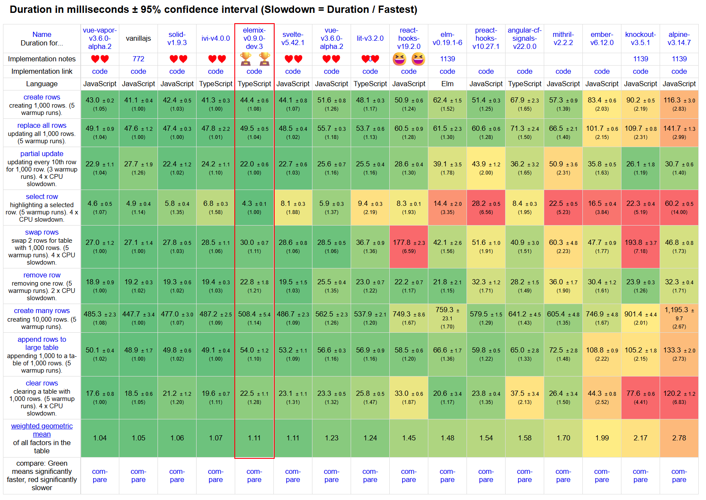

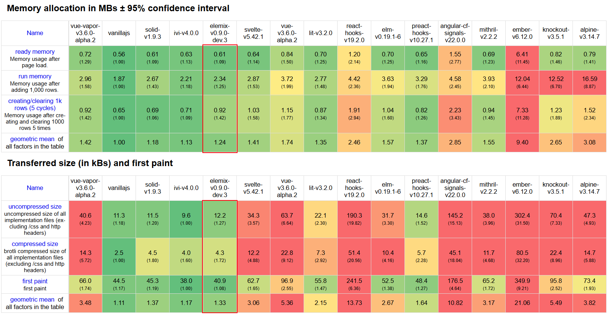

***Round 4*** 🏆🏆🏆

- This is an absolute blood bath, I love it 😍 Fighting for every millisecond 🥋👊😂
- This is at the floor now, fast enough in my books 🤓📖
- On par with `svelte` 🔥🔥🔥🥳
- Surrounded by good company 👌👏

- [x] Now I need a logotype or logo FML ☹️

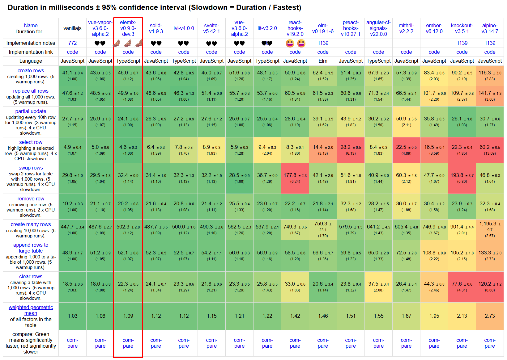

***Final Round 🦇🦇🦇***

- There 🧐💪
- Rerun benches for `vapor`, `elemix`, `solid`, `ivi` and `svelte` back to back 💨
- Still taking it with a pinch of salt until submitting to the official repo and getting results
  in a stable environment, this is good enough to eyeball it 👀👀
- I am spent 😰😰😰 Now all energy into release... 🚀

- [x] Deal with component inheritance 🤮🧐 This is a pandora box, do I even go there... It has to work though...
- [x] WASM package needs its own readme 🤔
- [x] A lot of structural changes, test the shite out of it 🔴🔴

- [x] Update playground with WASM compiler
  - [x] Update all examples with updated API
  - [x] Playground needs some cleanup, better file management for examples, atm just a giant file 🤮
  - [x] Add new examples to cover full usage

- [x] Add template repo 📍

- [x] Fix compiler output for tracked getters and setters - there is a high chance of clashing with private properties.
  The solution: move `#count` => `#__count` and so on. It is just a matter of time before this bites hard 🥲💥💥💥

```ts
    #count = state(0);
    #count_dep = dep();
    get count() {
        track(this.#count_dep);
        return this.#count;
    }
    set count(value) {
        const next = state(value);
        if (this.#count === next) return;
        this.#count = next;
        trigger(this.#count_dep);
    }
```